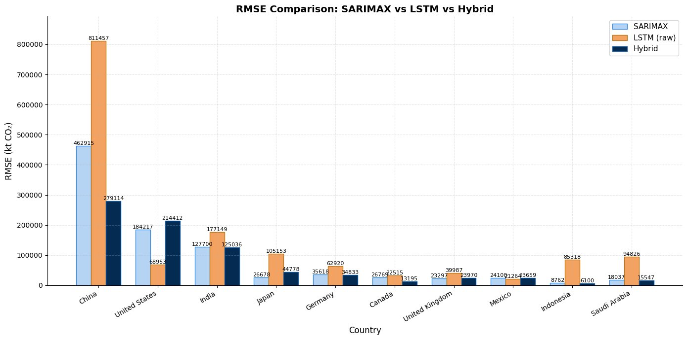

# 🌍 Hybrid Deep Learning Approach for Modelling Global CO₂ Emissions

[](https://opensource.org/licenses/MIT)
[](https://www.python.org/)
[](https://www.tensorflow.org/)
[]()

### SARIMAX + LSTM Hybrid Forecasting Framework

> **Final Year Project — BS Mathematics, NUST Islamabad (2026)**
> **Author:** Hafiza Alishba Naaz
> **Supervisor:** Dr. Tahir Mehmood, Department of Mathematics, School of Natural Sciences, NUST

---

## 🖥️ Try It Live

This project now ships as a working web app, not just notebooks — pick a
country, retrain the hybrid model live, and forecast future emissions, or
upload your own energy dataset and forecast on that instead.

- **Live app:** _add your deployed URL here once it's live_
- **Run it yourself:** see [Running the Web App](#️-running-the-web-app) below

---

## 📌 What This Project Does

This project builds a **hybrid forecasting model** that combines two powerful techniques:

- **SARIMAX** — a classical statistical model that captures linear CO₂ emission trends and the influence of economic/energy factors
- **LSTM (Long Short-Term Memory)** — a deep learning model that learns the nonlinear residual patterns left unexplained by SARIMAX

Together, they produce more accurate long-term CO₂ emission forecasts than either model can achieve alone.

The model was applied to **annual CO₂ emission data (2000–2019)** from the **world's top 10 emitting countries** and used to forecast emissions up to **2024**.

---

## 🌐 Countries Analyzed

| # | Country | # | Country |
|---|---------|---|---------|
| 1 | 🇨🇳 China | 6 | 🇮🇷 Iran |
| 2 | 🇺🇸 United States | 7 | 🇮🇩 Indonesia |
| 3 | 🇮🇳 India | 8 | 🇸🇦 Saudi Arabia |
| 4 | 🇷🇺 Russia | 9 | 🇰🇷 South Korea |
| 5 | 🇯🇵 Japan | 10 | 🇩🇪 Germany |

> These 10 countries account for nearly **70% of global CO₂ emissions**.

---

## 📊 Key Results

### Hybrid Model vs Standalone SARIMAX (Test Period: 2015–2019)

| Metric | SARIMAX Alone | Hybrid Model | Improvement |
|--------|--------------|--------------|-------------|
| Avg MAPE | 5.09% | 4.22% | ✅ −0.87 pp |
| Avg RMSE | 39,260 kt | 32,610 kt | ✅ −16.9% |
| Avg R² | 0.876 | 0.940 | ✅ +0.064 |

### Biggest Country-Level Improvements (RMSE Reduction)

| Country | RMSE Reduction |
|---------|---------------|
| 🇨🇳 China | −23.6% |
| 🇮🇳 India | −16.4% |
| 🇸🇦 Saudi Arabia | −16.3% |
| 🇺🇸 United States | −15.2% |

### RMSE Comparison: SARIMAX vs LSTM vs Hybrid



> The Hybrid model consistently achieves the lowest RMSE across all countries, outperforming both standalone SARIMAX and raw LSTM models.

### Residual Diagnostics
All 10 countries passed the **Ljung–Box white noise test** (p > 0.05), confirming the hybrid model successfully removed both linear and nonlinear dependencies from the residuals.

---

## 🔮 Future Forecasts (2020–2024)

| Country | Forecast 2024 (kt) | Trend |
|---------|-------------------|-------|
| 🇨🇳 China | 10,850,000 | ↘ −0.5% |
| 🇺🇸 United States | 4,720,000 | ↘ −6.0% |
| 🇮🇳 India | 2,950,000 | ↗ +18.0% |
| 🇷🇺 Russia | 1,650,000 | ↘ −1.2% |
| 🇯🇵 Japan | 1,050,000 | ↘ −3.5% |
| 🇮🇷 Iran | 780,000 | ↗ +7.5% |
| 🇮🇩 Indonesia | 620,000 | ↗ +5.0% |
| 🇸🇦 Saudi Arabia | 610,000 | ↗ +8.2% |
| 🇰🇷 South Korea | 600,000 | ↘ −0.8% |
| 🇩🇪 Germany | 680,000 | ↘ −2.5% |

**Key insight:** Developed economies show declining trends while rapidly industrializing nations continue to grow — highlighting the urgent need for climate policy in emerging economies.

---

## 🛠️ Methodology Overview

```
Raw Data (Kaggle - Global Sustainable Energy Dataset)
        ↓
Data Preprocessing
  • Missing value imputation (country-specific means)
  • Log(1+x) transformation for skewness
  • Train: 2000–2014 | Test: 2015–2019
        ↓
Feature Selection
  • Lasso / ElasticNet regularization
  • Granger causality testing
        ↓
Stage 1: SARIMAX Model
  • ADF stationarity test → differencing (d=1)
  • Auto ARIMA order selection (pmdarima)
  • Exogenous variables: GDP per capita, GDP growth,
    primary energy per capita, renewable energy share
  • Generates linear forecasts + residuals
        ↓
Stage 2: LSTM Residual Correction
  • MinMaxScaler normalization of residuals
  • 3-year sliding window lookback
  • Architecture: LSTM(32) → LSTM(16) → Dense(1)
  • Dropout(0.2), Adam optimizer, MSE loss
  • Autoregressive residual prediction
        ↓
Hybrid Output
  ŷ_hybrid = ŷ_SARIMAX + r̂_LSTM
        ↓
Evaluation: RMSE · MAE · MAPE · R²
Ljung–Box residual diagnostic test
        ↓
Future Forecasts (2020–2024)
  • Linear trend extrapolation of exogenous variables
  • Full dataset retraining → hybrid forecast
```

---

## 📦 Tech Stack

| Category | Libraries |
|----------|-----------|
| **Data Processing** | `pandas`, `numpy` |
| **Statistical Modeling** | `statsmodels`, `pmdarima` |
| **Deep Learning** | `tensorflow`, `keras` |
| **Feature Selection** | `scikit-learn` (Lasso, ElasticNet, MinMaxScaler) |
| **Evaluation** | `scikit-learn` (RMSE, MAE, R²) |
| **Visualization** | `matplotlib`, `seaborn` |
| **Web App** | `FastAPI`, vanilla JS + Chart.js |

---

## ⚙️ Installation & Setup (Notebooks)

```bash
# 1. Clone the repository
git clone https://github.com/alishbanaaz/A-Hybrid-Deep-Learning-Approach-For-Modelling-Global-Carbon-Emission.git
cd A-Hybrid-Deep-Learning-Approach-For-Modelling-Global-Carbon-Emission

# 2. Install dependencies
pip install -r requirements.txt

# 3. Download the dataset
# Dataset: Global Data on Sustainable Energy (Kaggle, 2023)
# https://www.kaggle.com/datasets/anshtanwar/global-data-on-sustainable-energy
# Place the CSV file in the /data folder

# 4. Run notebooks
jupyter notebook
```

---

## 📋 Requirements

```
pandas>=1.5.0
numpy>=1.23.0
statsmodels>=0.14.0
pmdarima>=2.0.0
scikit-learn>=1.2.0
tensorflow>=2.12.0
matplotlib>=3.7.0
seaborn>=0.12.0
jupyter>=1.0.0
```

---

## 🖥️ Running the Web App

Beyond the notebooks, this repo includes a full FastAPI application (in
`backend/`) that wraps the same hybrid SARIMAX+LSTM pipeline behind a web UI:
upload a CSV, pick a country, train live, and view a forecast chart, instead
of running notebook cells by hand.

```bash
cd backend
python3 -m venv venv
source venv/bin/activate        # Windows: venv\Scripts\activate

pip install -r requirements.txt
uvicorn main:app --reload
```

Open **http://127.0.0.1:8000**. Interactive API docs are at **/docs**.

**API summary:**

| Method | Path | Purpose |
|---|---|---|
| GET | `/api/data-summary` | Current dataset info |
| GET | `/api/countries?n=10` | Top-N countries by mean emissions |
| POST | `/api/upload-data` | Upload a CSV to replace the working dataset |
| POST | `/api/reset-data` | Revert to the original bundled dataset |
| POST | `/api/train/{country}?test_years=5&forecast_years=5` | Train + forecast for one country |
| GET | `/api/forecast/{country}` | Fetch the last trained result for a country |

### Deploying it so others can open a link

The `Dockerfile` in this repo works on any Docker-based host. Two free
options:

- **Render** — [render.com](https://render.com) → New Web Service → connect
  this GitHub repo → it auto-detects the `Dockerfile` → deploy. Free tier
  has 512 MB RAM, which is tight for TensorFlow but workable.
- **Hugging Face Spaces** — free CPU Docker Spaces currently require a PRO
  subscription (a recent platform change); Render is the free path for now.

See `DEPLOYMENT.md` for full step-by-step instructions.

---

## 🎯 Who Can Use This Project?

| Who | How |
|-----|-----|
| 🌱 **Climate researchers** | Extend the framework to more countries or longer horizons |
| 🏛️ **Policy makers & NGOs** | Use emission forecasts to plan climate interventions |
| 🎓 **ML/DS students** | Learn how to combine statistical + deep learning models |
| 📊 **Data scientists** | Reference for hybrid time-series forecasting methodology |
| ⚡ **Energy planners** | Understand emission-energy relationships for transition planning |
| 🔬 **Academic researchers** | Build on this work — extend to monthly data or Transformer models |
| 🖱️ **Anyone** | Use the live web app — no coding required, just upload data and click |

---

## 🔬 Research Gap Addressed

Most prior studies either:
- Use **only statistical models** (ARIMA/SARIMAX) — miss nonlinear patterns
- Use **only deep learning** (LSTM/GRU) — overfit on small annual datasets

This project fills the gap by combining both: SARIMAX captures linear structure and exogenous effects, while LSTM corrects the remaining nonlinear residuals — giving the best of both worlds.

---

## 🚀 Future Work

- [ ] Extend to monthly/quarterly data for richer LSTM training
- [ ] Incorporate more exogenous variables (carbon tax, industrial regulation, population)
- [ ] Explore Transformer-based architectures (Temporal Fusion Transformer)
- [ ] Add prediction intervals / uncertainty quantification
- [ ] Validate on regional or sector-level emission data
- [x] Deploy as an interactive web app (FastAPI, see above)

---

## 📄 Citation

If you use this work, please cite:

```bibtex
@thesis{naaz2026hybrid,
  title     = {A Hybrid Deep Learning Approach for Modelling Global Carbon Emissions},
  author    = {Naaz, Hafiza Alishba},
  year      = {2026},
  school    = {National University of Sciences and Technology (NUST)},
  type      = {BS Final Year Project},
  supervisor= {Dr. Tahir Mehmood},
  department= {Department of Mathematics, School of Natural Sciences}
}
```

---

## 📬 Contact

**Hafiza Alishba Naaz**
BS Mathematics — NUST Islamabad
📧 alishbanaaz91@gmail.com
📧 alishbanaaz@students.nust.edu.pk

---

<p align="center">
  Made with ❤️ at NUST Islamabad · Department of Mathematics · 2026
</p>
